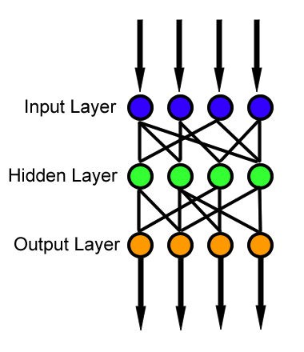

---
bibliography:
- docs/Hauptdatei.bib
---


Technische Hochschule Rosenheim

Fakultät für Informatik


**Seminararbeit**

**im Masterstudiengang Informatik - Schwerpunkt Software Engineering**


  ------------------ -- ------------------------------------------------- --
  **Thema:**            Optimierungsmethoden des Gradienten               
                        Abstiegverfahrens bei neuronalen Netzen           
                                                                          
  **Autor:**            Victor Wolf / Victor.Wolf\@stud.fh-rosenheim.de   
                        MatNr. 845615                                     
                                                                          
  **Version vom:**      28.12.2019                                                  
                                                                          
  **Betreuer:**         Prof. Dr. Holaubek                                
  ------------------ -- ------------------------------------------------- --

Zusammenfassung 
===============

Diese Arbeit wird sich mit verschiedenen Optimierungsalgorithmen des
Gradienten Abstiegsverfahren bei neuronalen Netzen beschäftigen und
diese auf Basis von Beispieldatensätzen evaluieren. Hierbei wird eine
Metrik definiert um die Ergebnis der einzelnen Optimierungsmethode zu
vergleichen.

Ein Optimierungsalgorithmus ist eine Möglichkeit die Konvergenz der
Fehlerfunktion $J(\theta)$ des neuronalen Netzes beim Lernen zu
verbessern.

Hierbei wird auf den Lern Prozess des Neuronalen Netzes eingegangen.
Besonderen Fokus wird der "Gradient Descent", zu Deutsch Gradienten
Abstiegsverfahren, einnehmen, da dies die Grundlage des Lernens
darstellt. Dieser sucht im mehrdimensionalen Raum die Minima der
nichtlinearen Fehlerfunktion. Die Verbesserung dieser Suche machen sich
die Optimierungsalgorithmen zur Aufgabe. Nach der theoretischen
Aufarbeitung, werden wir ein paar Eigenschaften über diese
Optimierungsmethoden annehmen ,um diese anhand der Testdaten zu
überprüfen und mit der Literatur zu vergleichen.

Abstract 
========

This work will focus on explaning the different optimization methods of
the gradient descent algorithm of neural networks and evaluating them on
example datasets. We will define a metric to be able to evaluate the
performance of the different optimizer.

An optimization method is a way to improve the performance of the error
function $J(\theta)$ of the neural network.

Furthermore this work will give a detailed explanation of the learning
process of Neural Networks especially focusing on the Gradient Descent,
which is the foundation of learning in neural networks. This algorithm
aims to find local minima in the Hyperplane of the non-linear error
function. The optimization algorithms aim to improve this search. After
the Theory, we will assume some properties about those optimization
methods and test those assumptions by evaluating the metrics of the
neural networks. Then we will compare our results to the literature

Einleitung
==========

Neuronale Netze sind ein weit verbreitetes Thema. Dabei wird ihnen oft
mehr "Magie" zugesprochen als in ihnen eigentlich enthalten ist. Der
Lernprozess eines neuronalen Netzes ist nämlich einfach ein sinnvoller
Algorithmus, der auf viele Problemstellungen angewandt werden kann.
Jedoch kann jeder Algorithmus verbessert werden. Der grundlegende
Algorithmus ist hierfür der sogenannte Gradient Descent oder zu deutsch
Gradienten Abstiegsverfahren. Dieser weißt jedoch verschiedene Probleme
auf. Deshalb gibt es Optimierungsalgorithmen, die die Fehler des
grundlegenden Algorithmus verbessern wollen. Hierbei ist die Wahl des
Optimierungsalgorithmus jedoch nicht immer eindeutig. Diese gibt es
reichlich und es ist nicht immer offensichtlich, welcher Algorithmus wo
angewandt werden sollte. Deshalb greift sich diese Arbeit drei bekannte
Optimierungsalgorithmen heraus und evaluiert diese anhand von geeigneten
Metriken. Dabei wird ein Python Programm erstellte, um diese Fragen
beantworten zu können. Um die Problematik zu beleuchten, wird erst in
die Theorie der neuronale Netze und des Gradienten Abstiegsverfahrens
eingeführt. Anschließend werden die verschiedenen
Optimierungsalgorithmen theoretisch aufgearbeitet. Im Anschluss wird
sich mit den genutzten Metriken und dem Aufbau des Programms
beschäftigt. Schlussendlich werden die Ergebnisse ausgewertet und mit
der Literatur verglichen.

Theoretische Grundlagen 
=======================

Neuronale Netze 
---------------

Künstliche Neuronale Netze kurz KNNs sind der menschliche Versuch das
biologische Nervensystem nachzuahmen. Sie basieren auf der Tatsache der
Reizweitergabe. So wird ein Eingangsreiz von Rezeptoren aufgenommen und
über verschiedene sogenannter Neuronen weitergegeben. Durch diese
Weitergabe wird das Signal verändert, bis ein Ausgangssignal
interpretiert werden kann. Diese Funktionsweise macht man sich bei
künstlichen Neuronalen Netzen zu nutze. Der Eingangsreiz sind hier die
sogenannten features, der Ausgangsreiz eine Klasse oder ein Wert der
interpretiert werden kann. Wir wollen uns hier nun nur auf die Feed
Forward Netze fokussieren. Das bedeutet das Neuronen ihre Ausgabe nur in
eine Richtung schicken dürfen.



KNNs existieren in zwei Zuständen der Trainingsphase und der
Arbeitsphase. Die Trainingsphase ist die interessantere und wird in
dieser Arbeit beleuchtet. Hier werden durch Optimierung der
Fehlerfunktion die Neuronen so "eingestellt" , dass sie einen möglichst
gute Vorhersage treffen.

Im Folgenden soll nun der Begriff des Neurons formalisiert werden, um
die Verbesserungsmöglichkeiten des Gradienten Abstiegverfahrens in
Abschnitt [2.3](#Optimierungsmethoden){reference-type="ref"
reference="Optimierungsmethoden"} nachvollziehen zu können.

[\[Def:formales Neuron\]]{#Def:formales Neuron
label="Def:formales Neuron"} [@BurkhardLenze.1997 Kapitel 1.2] Ein
(**formales) Neuron** ist eine Funktion
$\kappa: \mathbb{R}^n \rightarrow \mathbb{R}^m$ definiert durch:

-   eine Aktivierungsfunktion $T:\mathbb{R} \rightarrow \mathbb{R}$

-   ein gewichteter Vektor $\vec{w} = \{w_1,w_2,...,w_n\}$

-   und eine Schwelle $\Theta\in\mathbb{R}$.

Der Vektor $\vec{x} = (x_1,x_2,...,x_n)\in \mathbb{R}^n$ wird auf den
Vektor $\vec{y} = (y,y,...,y)\in \mathbb{R}^m$ mit identischen
Komponenten durch die folgende Rechenvorschrift abgebildet
$$\begin{aligned}
\kappa(\vec{x}):= (T(\sum\limits_{i=1}^n w_i x_i - \Theta),...,T(\sum\limits_{i=1}^n w_i x_i - \Theta))=\vec{y} \in \mathbb{R}^m\end{aligned}$$

Hier seien ein paar Beispiele für Aktivierungsfunktionen angegeben

-   Identität $T_I$ $$\begin{aligned}
    T(x):=x=T_I(x)\end{aligned}$$

-   Binary step $$\begin{aligned}
    T(x) := \begin{cases} 0, \text{ for } x < 0 \\ 1, \text{ for } x \geq 0 \end{cases} =: T_1 (x)\end{aligned}$$

-   Sigmoid $$\begin{aligned}
    T(x) := \frac{1}{1+e^{-x}} =: T_S(x)\end{aligned}$$

-   Tangens hyperbolicus $$\begin{aligned}
    T(x) := \frac{1+tanh(x)}{2} =: T_H(x)\end{aligned}$$

Dies sind nur ein paar wenige Beispiele. Jede Funktion
$T:\mathbb{R}\rightarrow \mathbb{R}$ die
$\lim\limits_{x \rightarrow -\infty}{T(x)}=0$ and
$\lim\limits_{x \rightarrow \infty}{T(x)}=1$ erfüllt, kann als
Aktivierungsfunktion genutzt werden.

[@MichaelNielsen.Juni2019 Kapitel 2] Die **Fehlerfunktion** $J(\theta)$
eines Neuronalen Netzes ist eine differenzierbare Funktion für die gilt:

-   $J(\theta) = \frac{1}{n} \sum_x J_x$ wobei $x$ ein Eingabe Datum
    beschreibt.

-   $J(\theta)$ lässt sich aus der Summe der Elemente des Ausgabe
    Vektors darstellen.

Die erste Eigenschaft bedeutet, dass die gesamte Fehlerfunktion sich
auch durch die Fehlerfunkton der einzelnen Eingabe Daten darstellen
lässt. Diese Fehlerfunktion wird im nächsten Abschnitt minimiert werden,
um eine optimale Parameterbelegung der Gewichte $\vec{w}$ zu finden.
Beispiel für eine solche Funktion wäre der mittlere quadratische Fehler.

Gradient Descent 
----------------

Der Gradient Descent oder zu Deutsch Gradienten Abstiegsverfahren ist
ein Weg eine Zielfunktion $J(\theta)$ parametrisiert durch
$\theta \in \mathbb{R}^n$ zu minimieren. Man aktualisiert diese
Parameter in Richtung des stärksten Abstiegs der Zielfunktion
$\nabla_\theta J(\theta)$. Die Lern Rate $\mu$ bestimmt dabei die Größe
der Aktualisierungsschritte. Das Verfahren folgt also der Richtung des
Abstiegs der Oberfläche der Zielfunktion in ein Tal, welches ein lokales
Minimum beschreibt. [@Ruder.9152016 Kapitel 1]\
Im Fall eines neuronalen Netzes ist die Zielfunktion $J(\theta)$ die
Fehlerfunktion des neuronalen Netzes. Wir brauchen einen solchen
Algorithmus, da durch die Aktivierungsfunktion der Neuronen wie in
[2.1](#Neuronale Netze){reference-type="ref"
reference="Neuronale Netze"} beschrieben, die Fehlerfunktion nichtlinear
wird und somit die Minima sich nicht mehr analytisch berechnen lassen.
Um die Richtung des stärksten Abstiegs der Fehlerfunktion zu bestimmen,
benötigen wir den Gradienten.

[@Konigsberger.2002] Der **Gradient** $\nabla$ der total
differenzierbaren Funktion $f:\mathbb{R}^n \rightarrow \mathbb{R}$ im
Punkt $a\in\mathbb{R}$ ist im Falle des Standard Skalar Produkts
definiert durch: $$\begin{aligned}
        \nabla f := \frac{\partial f}{\partial x_{1}}\hat{e}_{1}+\cdots+\frac{\partial f}{\partial x_{n}}\hat{e}_{n}
    \end{aligned}$$

In einfachen Worte gefasst, ist der Gradient die Ableitung einer
mehrdimensionalen Funktion, deren Funktionswerte man sich als Gebirge
vorstellen kann. Hierbei ist der Gradient, in einen Punkt, ein Vektor,
der in die Richtung des stärksten Anstiegs zeigt.\
Um die Richtung des stärksten Abstiegs zu erhalten, welche wir beim
Gradienten Abstiegsverfahren benötigen, müssen wir nur den negativen
Gradienten berechnen.\
\
Mit diesem Wissen können wir nun den Standard Gradient Descent
Algorithmus definieren.

[@Ruder.9152016 Kapitel 2.1] Der sogenannte **batch gradient descent**,
berechnet den Gradienten der Kostenfunktion für den gesamten Datensatz.
Jedes Update der Parameter ist definiert durch $$\begin{aligned}
        \theta = \theta - \eta \cdot \nabla_\theta J(\theta)
    \end{aligned}$$ wobei $\eta$ die Lern Geschwindigkeit beschreibt.

Als Algorithmus würde der batch gradient descent folgendermaßen
aussehen.

``` {.python language="Python"}
for i in range(nb_epochs ):
    params_grad = evaluate_gradient(loss_function , data , params)
    params = params  - learning_rate * params_grad
```

wobei `nb_epochs` die Anzahl der Iterationen beschreibt. Diese
Implementierung beschreibt die grundsätzliche Idee aber hat mehrere
Nachteile. Da wir den Gradienten für den gesamten Datensatz berechnen
ist diese Methode sehr langsam und nicht möglich für Datensätze, die
nicht in den Arbeitsspeicher passen. Außerdem konvergiert dieser
Algorithmus nur sehr langsam gegen ein lokales Minimum. Zusätzlich ist
die Wahl der perfekten Lern Geschwindigkeit oft schwierig.\
Zusätzlich benötigt man den Backpropagation Algorithmus um dieses
Verfahren auf ein gesamtes neuronales Netz anzuwenden. Dieser ist aber
ebenfalls sehr komplex und wird deshalb hier nicht behandelt. Er kann in
[@MichaelNielsen.Juni2019 Kapitel 2] nachgelesen werden.

Optimierungsmethoden 
--------------------

Im vorherigen Abschnitt haben wir die Grundlagen des Gradienten
Abstiegsverfahren kennengelernt und gesehen, dass dieses Probleme mit
sich bringt. Die folgenden Optimierungsmethoden verbessern das
grundsätzliche batch gradient descent Verfahren in die ein oder andere
Richtung.

### Stochastic Gradient Descent 

[@Ruder.9152016 Kapitel 2.2] Der Aktualisierungsschritt des **stochastic
gradient descent** ist definiert durch $$\begin{aligned}
        \theta = \theta - \eta \cdot \nabla_\theta J(\theta;x^{(i)};y^{(i)})
    \end{aligned}$$

Der Unterschied zum **batch gradient descent** ist nur, dass der
Aktualisierungsschritt für jedes einzelne Datum ausgeführt wird. Das
macht den Algorithmus wesentlich schneller, aber lässt ihn ebenfalls
stärker schwanken, während er ein lokales Minimum sucht. Dies kann
positiv wie negativ sein, da eine solche Schwankung den Algorithmus
Ebenen schneller überwinden lässt, aber manchmal auch Minima
überspringen lässt. Um eine gut Konvergenz zu gewährleisten, erweitert
man den Algorithmus noch um zwei Eigenschaften.

-   Die $x^{(i)}, y^{(y)}$ werden jede Iteration zufällig angeordnet

-   Die Lern Geschwindigkeit $\eta$ wird linear verkleinert.

Der stochastic gradient descent kann durch folgende Eigenschaft noch
erweitert werden.

$$\begin{aligned}
    \theta = \theta - \eta \cdot \nabla_\theta J(\theta;x^{(i:i+n)};y^{(i:i+n)})\end{aligned}$$

Nun wird nicht mehr für jedes einzelne Datum der Gradient berechnet,
sondern für einen Teilmenge der Größe $n$. In mancher Literatur, wird
dieser Algorithmus noch einmal extra als **Mini-batch gradient descent**
benannt. [@Ruder.9152016 Kapitel 2.3]. In den Implementierungen wird
hier jedoch meist keine Unterscheidung mehr getroffen.
[@chollet2015keras]

### Adagrad 

Der Adagrad Algorithmus erweitert den Stochastic Gradient Descent noch
weiter. Bisher wurde die Lern Geschwindigkeit $\eta$ entweder konstant
gelassen oder linear verkleinert. Die Lern Geschwindigkeit hat somit
keinen Bezug auf die Trainingsdaten. Hier setzt Adagrad an. Er verändert
die Lern Geschwindigkeit im Verhältnis zur Dichte des jeweiligen
Parameters.

Deshalb hängt der Algorithmus diesmal auch von jedem einzelnen Elemente
von $\theta$, bezeichnet als $\theta_i$ ab.

[@Ruder.9152016 Kapitel 4.3] Der **Adagrad** Algorithmus ist definiert
durch den Aktualisierungsschritt $$\begin{aligned}
        \theta_{t+1,i} = \theta_{t,i} - \frac{\eta}{\sqrt{G_{t,ii}+\epsilon}} \cdot g_{t,i}
    \end{aligned}$$ wobei $g_{t,i}$ definiert ist durch
$$\begin{aligned}
        g_{t,i} = \nabla_{\theta_t} J(\theta_{t,i})
    \end{aligned}$$ und $G_t \in R^{d\times d}$ ist eine diagonal
Matrix, wobei die Diagonalelemente $i,i$, die Summe der Quadrate der
Gradienten zum zugehörigen Parameter $\theta_i$ bis zum Zeitpunkt t sind
und $\epsilon > 0$

Dies bringt eine große Erleichterung im Vergleich zu den bisherigen
Algorithmen. Durch die automatische und variable Anpassung der Lern
Geschwindigkeit gewinnt man eine einfachere Implementierung und bessere
Ergebnisse.\
\
Adagrad hat jedoch einen Nachteil, durch die quadrierten summierten
Gradienten unter dem Bruch konvergiert die Veränderung der Parameter
gegen null. Deshalb kann Adagrad situationsbedingt auch schlechter als
die bisherig vorgestellten Algorithmen sein.

### Adam 

[@DiederikP.KingmaandJimmyLeiBa.2015] Adaptive Moment Estimation (Adam)
ist ein Weiterer Algorithmus, der sich wie Adagrad adaptiv an den
jeweiligen Parameter anpasst. Er versucht aber gleichzeitig das Problem
der summierten Gradienten zu umgehen.

Der **ADAM** Algorithmus ist definiert durch den Aktualisierungsschritt
$$\begin{aligned}
        \theta_{t+1} = \theta_t +\frac{\eta}{\sqrt{\hat{v}_t}+\epsilon}\hat{m}_t
    \end{aligned}$$ wobei $$\begin{aligned}
        \hat{m}_t = \frac{\beta_1 m_{t-1} + (1- \beta_1) g_t}{1-\beta^t_1}
    \end{aligned}$$ und $$\begin{aligned}
        \hat{v}_t = \frac{\beta_2 v_{t-1} + (1- \beta_2) g_t^2}{1-\beta^t_1}
    \end{aligned}$$ wobei $\hat{m_t}$ den Mittelwert des Gradienten über
die Zeit beschreibt und $\hat{v_t}$ die Varianz. $\beta_1$ und $\beta_2$
sind dabei Zerfall Raten, die bestimmen, wieviel Einfluss die
vergangenen Gradienten auf den neuen Wert nehmen.

Adam ist deswegen ein sehr beliebter Optimierungsalgorithmus, da er
nicht nur adaptiv für jeden einzelnen Parameter arbeitet, sondern durch
die Anpassung mit Mittelwert und Varianz der vergangenen Gradienten
statistisches Wissen über die Beschaffenheit der Oberfläche mit
einbringt.

Evaluation 
==========

In diesem Kapitel wollen wir uns jetzt mit der Analyse der einzelnen
Optimierungsmethoden beschäftigen. Mithilfe des vorherigen Kapitel
wollen wir nachweisen, dass ein theoretisch besserer Algorithmus auch
wirklich besser arbeitet. Was in diesem Fall besser bedeutet soll
ebenfalls geklärt werden.

Test Datensatz 
--------------

Um ein neuronales Netz zu bewerten, brauchen wir zunächst einige Test
Daten, hierbei werden die beiden frei verfügbaren Datensätze, der
*Boston House Price* Datensatz und der *Breast Cancer* Datensatz. Beide
sind im *scikit-learn* Paket [@scikit-learn] enthalten.

### Boston House Price 

Der *Boston House Price* Datensatz besteht aus einem Regressionsproblem.
Das bedeutet, dass wir eine reelle Zahl mit unserem Netz voraussagen
wollen, nämlich den Preis eines Hauses in Boston. Damit das das Netz
lernen kann gibt es einige explanatorische Variablen wie unter anderem

-   **CRIM**: Die Verbrechensrate pro Kopf.

-   **RM**: Die Anzahl der Räume im Haus.

-   **TAX**: Steuer die auf das Grundstück gezahlt werden muss.

-   **DIS**: gewichteter Abstand zum Zentrum von Boston.

Mit diesen, insgesamt 13 Hilfsvariablen soll das Netz den Haus Preis
voraussagen.

![Beispiel des Boston
Datensatzes[]{label="fig:BostonBeispiel"}](docs/abb/BostonBeispiel.PNG){#fig:BostonBeispiel
width="100%"}

### Breast Cancer 

Der *Breast Cancer* Datensatz hingegen besteht aus einem binären
Klassifikationsproblem. Das bedeutet, dass das Netz nur "ja" oder "nein"
kodiert als eins oder null, voraussagen soll. Hierbei bedeutet ein Ja,
dass diese Person Brustkrebs hat. Hier gibt es wieder einige
explanatorische Variablen, die dem Netz helfen sollen zu lernen. Diese
sind Eigenschaften des Nukleus einer entommenen Brustzelle

-   **radius**: Radius des Nukleus

-   **texture**: Standardabweichung der Graustufenwerte

-   **symmetry**: Symmetrie des Nukleus

-   **smoothness**: Lokale Abweichung der Radius Länge

Insgesamt besteht der Datensatz aus 30 solchen Variablen.

![Beispiel des Breast Caner
Datensatzes[]{label="fig:BreastCancerBeispiel"}](docs/abb/BreastCancerBeispiel.PNG){#fig:BreastCancerBeispiel
width="100%"}

Metrik 
------

Bevor wir mit dem Vergleich der verschiedenen Optimierungsmethoden der
Gradienten beginnen können, brauchen wir ein Maß für die Güte eines
Ergebnisses. Dafür müssen wir eine Metrik definieren. Sinnvoll ist es
ein neuronales Netz daran zu messen, wieviel es richtig bewertet hat.
Richtig ist im Falle des *Breast Cancer* Datensatzes einfach ob das Netz
ja zu ja und nein zu nein gesagt hat. Im Falle des *Boston House Price*
Datensatzes ist richtig, wenn der Abstand vom vorhergesagten zum echten
Preis möglichst klein ist. Dies gibt uns eine Vielzahl von Metriken die
diese Voraussetzungen erfüllen.\
Günstiger Weise benötigen wir bereits durch das Training des neuronalen
Netzes eine Gütefunktion die angibt ob sich die Parameter in die
richtige Richtung bewegen. Diese ist die in Abschnitt
[2.1](#Neuronale Netze){reference-type="ref"
reference="Neuronale Netze"} bereits besprochene Fehlerfunktion des
Netzes. Diese sollte unsere erste Form einer Metrik sein um das
Neuronale Netz zu bewerten.

Für den *Boston House Price* Datensatz ist diese Fehlerfunktion die
*mittlere quadratische Abweichung*.

[@Fahrmeir.2016 S.344] Die **mittlere quadratische Abweichung** für eine
Stichprobe $x_1,...,x_n$ mit Schätzwerten $\hat{x}_1,...,\hat{x}_n$ ist
definiert durch $$\begin{aligned}
        \frac{1}{n}\sum\limits_{i=1}^{n} (\hat{x}_i-x_i)^2
    \end{aligned}$$

Dies ist die typische Fehlerfunktion für Regressionsprobleme. Man mag
sich fragen warum diese quadriert wird und nicht der absolute Abstand
zum echten Wert genommen wird, wie vorher überlegt. Diese Funktion ist
aber diejenige aus der wir den Gradienten berechnen wollen, also muss
sie differenzierbar sein, was das Quadrat gewährleistet.\
Für den *Breast Cancer* Datensatz ist diese Funktion jedoch
unzureichend, da nur null oder eins im Wertebereich der mittleren
quadratischen Abweichung vorkommen würden. Da es sich hier um ein
binäres Klassifikationsproblem handelt, eignet sich die *binäre
Kreuzentropie*.

[@Rubinstein.2004] Die **binäre Kreuzentropie** für eine Stichprobe
$x_1,...,x_n$ mit Schätzwerten $\hat{x}_1,...,\hat{x}_n$ ist definiert
durch $$\begin{aligned}
        \frac{1}{n}\sum\limits_{i=1}^{n} x_i log(\hat{x}_i) + (1-x_i)log(1-\hat{x}_i)
    \end{aligned}$$ wobei $log$ der natürliche Logarithmus ist.

Diese Fehlerfunktion ist geeignet für Wertebereiche zwischen null und
eins. Also genau passend für ein zwei Klassen Klassifikationsproblem.\
Diese beiden Fehlerfunktionen geben uns eine erste Idee für die Güte des
neuronalen Netzes und deren Prädiktion und damit auch einen Indikator,
welches Netz den besseren Optimierungsalgorithmus besitzt, wenn sonst
alle Parameter gleich bleiben. Zusätzlich nehmen wir um mehr
Vergleichbarkeit zu schaffen eine weitere Fehlerfunktion hinzu, die nur
der Evaluierung der besseren Optimierungsmethode dient und nicht für das
Gradienten Abstiegsverfahren genutzt wird. Im Falle des *Boston House
Price* Datensatzes benutzen wir noch den *Mittleren absoluten Fehler*.

Der **Mittlere absolute Fehler** für eine Stichprobe $x_1,...,x_n$ mit
Schätzwerten $\hat{x}_1,...,\hat{x}_n$ ist definiert durch
$$\begin{aligned}
        \frac{1}{n}\sum\limits_{i=1}^{n} | \hat{x}_i-x_i |
    \end{aligned}$$

Dies ist die intuitivere Definition des Fehlers und ist somit geeignet
um die Optimierungsmethoden zu vergleichen.

Für den *Breast Cancer* Datensatz benutzen wir zusätzlich die
*Accuracy*, um die Ergebnisse des neuronalen Netzes vergleichbarer zu
machen.

Die **Accuracy** einer Stichprobe der Größe $n$ ist definiert durch
$$\begin{aligned}
        Accuracy = \frac{\text{Anzahl korrekter Voraussagen}}{n}
    \end{aligned}$$

Diese ist ebenfalls das intuitivere Verständnis der Güte eines
neuronalen Netzes und hilft somit bei der Auswertung der
Optimierungsalgorithmen.

Programm 
--------

Für einen Aufbau eines solchen Netzes und die Anwendung des Gradienten
Abstiegsverfahrens gibt es bereits verschiedenste Frameworks. Diese
stehen vor Allem in *Python* zur Verfügung, da diese eine der
vorrangigen KI Sprachen ist. Aus diesem Grund wird das folgende Programm
für die Auswertung der Optimierungsalgorithmen, auf unseren zwei Test
Datensätzen, ebenfalls in *Python* implementiert sein.

### Frameworks

Um uns die Arbeit zu erleichtern und um die Optimierungsalgorithmen,
sowie das neuronale Netz nicht selbst implementieren zu müssen benutzen
wir einige Frameworks.

-   **Keras** [@chollet2015keras]: Ein Framework, um neuronale Netze
    durch ein "Baustein" artiges Prinzip aufzubauen.

-   **Scikit-learn** [@scikit-learn]: Ein Framework, welches viele
    machine learning- sowie Vorverarbeitungsalgorithmen als
    Funktionsaufruf zur Verfügung stellt.

-   **Pandas** [@mckinney-proc-scipy-2010]: Ein Framework, was uns
    tabellenartige Datenstrukturen zur Verfügung stellt, welche die
    Weiterverarbeitung vereinfachen.

-   **Numpy** [@numpy]: Ein Framework für wissenschaftliche Berechnungen
    in Python, wie zum Beispiel Matrizenmultiplikation.

### Aufbau 

Die Idee hinter dem Aufbau des Python Programms war eine Objekt
orientierte Klassenlandschaft zu erstellen, um möglichst allgemein die
verschiedenen Optimierungsalgorithmen an unterschiedlichen Neuronalen
Netzen und Datensätzen zu testen. Das folgende UML-Diagramm
veranschaulicht diese Prämisse.

![UML-Diagramm des Python
Programms[]{label="fig:UML"}](docs/abb/STI_fertig.png){#fig:UML width="100%"}

Die wichtigste Klasse hier ist der `DataEvaluator`. Er verallgemeinert
das Konzept einer Testklasse, die Neuronale Netze zu bestimmten
Datensätzen auswertet. Was dabei ausgewertet wird, wird allgemein
gehalten. Die konkrete Implementierung erfolgt in der
`OptimizerEvaluator` Klasse, die mit der `evaluate_all` Methode die
eigentliche Auswertung der Optimierungsalgorithmen übernimmt. Diese erbt
von `DataEvaluator` und besitzt somit dessen Attribute, die vom Typ
`NeuralNetworks` und `Datasets` sind.

Diese besitzen jeweils ein dictionary Attribut, in dem sie nach dem key
value Prinzip ihre jeweiligen Inhalte speichern. In `Datasets` werden
die Auszuwertenden Datensätze gespeichert. Diese Datensätze sind vom Typ
`FeatureTargetData`.

Dieser neue Datentyp wird benötigt um später einfach zwischen
explanatorischen Variablen und Zielvariablen zu unterscheiden. In `X`
werden die explanatorischen Variablen gespeichert und in `y` die
Zielvariable. Zusätzlich speichern wir die Art der Vorhersage, die auf
dem Datensatz möglich ist. Also entweder "Regression" oder
"Klassifikation". Wir benötigen diese Information, um später die
richtigen Metriken auszuwählen. Wie in Abschnitt
[3.2](#Metrik){reference-type="ref" reference="Metrik"} erläutert,
benutzen wir verschiedene Metriken für Regressions- und
Klassifikationsprobleme.

In der `Neural Networks` Klasse werden die neuronalen Netze, die uns das
Keras Framework zur Verfügung stellt gespeichert. Dabei wird nur deren
Struktur gespeichert. Die Gewichte werden erst später angepasst, wenn
wir das Netz auf einen Datensatz trainieren.

### Netzstruktur

Oftmals steht und fällt ein neuronales Netz mit seiner vorher
festgelegten Struktur. Diese kann das Netz nicht selbst lernen, sondern
muss vom Menschen vorgegeben werden. Da unser Hauptfokus jedoch der
Vergleich der Optimierungsalgorithmen ist, und nicht der Aufbau eines
perfekten neuronalen Netzes, ist die Netzstruktur eher zweitrangig.
Zusätzlich sind die Testdatensätze eher einfachere Probleme, die auch
simple neuronale Netzstrukturen gut lernen können. Wichtig ist nur, dass
wir immer den gleichen Netzaufbau für jede Optimierung benutzen um
Vergleichbarkeit zu schaffen.

Im folgenden soll die Netzstruktur, die wir für die Regressionsprobleme
des *Boston House Price* Datensatzes benutzen erläutert werden.

``` {.python language="Python"}
_regression_NN_boston = Sequential()
_regression_NN_boston.add(
    Dense(units=160, activation='relu', input_shape=(13,)))
_regression_NN_boston.add(Dense(units=64, activation='relu'))
_regression_NN_boston.add(Dense(units=1, activation='linear'))
```

Diese Definition ist für das *Keras* Framework gedacht. Hier definiert
man jede Ebene des Netzes nacheinander. Wir initialisieren das Netz mit
dem `Sequential` Konstruktor. Das bedeutet, dass wir ein normales feed
forward Netz bauen wollen, wie in Abschnitt
[2.1](#Neuronale Netze){reference-type="ref"
reference="Neuronale Netze"} erläutert. Nun fügen wir die erste Ebene
des Netzes hinzu. Diese ist `Dense`, was bedeutet, dass jedes Neuron mit
jedem verknüpft ist. Außerdem sind insgesamt 160 Neuronen in dieser
Ebene. Die Anzahl der Neuronen ist üblicherweise ein Indikator dafür,
wie komplex das Netz ist und vor Allem wie komplex das Problem ist,
welches das Netz versucht zu lösen. Für diese einfache Problematik
sollten 160 Neuronen jedoch ausreichen\
In dieser Ebene verwenden wir die nichtlineare Aktivierungsfunktion
*Relu*, wie in Definition
[\[Def:formales Neuron\]](#Def:formales Neuron){reference-type="ref"
reference="Def:formales Neuron"} bereits erläutert, wird diese
nichtlineare Funktion benötigt um nichtlineare Probleme zu lösen und
macht somit das Gradienten Abstiegsverfahren erst notwendig. Da es sich
hier um eine innere Schicht eines feed forward Netzes handelt ist die
Wahl von Relu eindeutig. Diese hat sich in den letzen Jahren als beste
Aktivierungsfunktion für innere Schichten herausgestellt.
[@Goodfellow.2016 S. 226] Der Parameter `input_shape` gibt an wie viele
explanatorische Variablen dem Netz zugeführt werden. Wie in Abschnitt
[3.1.1](#Boston House Price){reference-type="ref"
reference="Boston House Price"} besprochen, besitzt der *Boston House
Price* Datensatz 13 explanatorische Variablen. Mit diesem Prinzip wird
noch eine innere Schicht hinzugefügt und schließlich die Ausgabeschicht
die nur aus einem einzigen Neuron besteht, da wir hier die Zahl für den
Preis erwarten.\
Für den *Breast Cancer* Datensatz ergibt sich ein ähnlicher Aufbau.

``` {.python language="Python"}
_classification_NN_breast_cancer = Sequential()
_classification_NN_breast_cancer.add(
    Dense(40, input_shape=(30,), activation='relu'))
_classification_NN_breast_cancer.add(Dense(20, activation='relu'))
_classification_NN_breast_cancer.add(Dense(1, activation='sigmoid'))
```

Nur das hier in der Ausgabeschicht die *Sigmoid* Funktion verwendet
wird, da wir eine Zahl zwischen null und eins erwarten. Nämlich die
Wahrscheinlichkeit für Brustkrebs.

Auswertung {#Auswertung}
----------

Nun ist alles bereit um die verschiedenen Netze mit unterschiedlichen
Optimierungsalgorithmen zu trainieren und diese anschließend mit den
Metriken aus Abschnitt [3.2](#Metrik){reference-type="ref"
reference="Metrik"} zu bewerten.

### Erwartungen 

Wir werden die drei vorgestellten Algorithmen

-   Stochastic Gradient Descent

-   Adagrad

-   ADAM

anwenden und ihre Performance mithilfe der Metriken messen. Der
*Stoachstic Gradient Descent* ist dabei der simpelste Algorithmus. Also
würden wir erwarten, dass dieser die schlechtesten Ergebnisse liefert.
*Adagrad* und *ADAM* sind ähnlich, jedoch benutzt ADAM noch mehr
Informationen als Adagrad. *ADAM* sollte somit die beste Performance
haben. Adagrad sollte aber auch nicht schlecht sein, da beide Datensätze
eher klein sind und somit eine adaptive Anpassung der Gewichte wichtig
ist.

### Boston House Price Auswertung 

Für die Auswertung des *Boston House Price* Datensatzes haben wir den
*MSE* (in der Abbildung [4](#fig:BHPAuswertung){reference-type="ref"
reference="fig:BHPAuswertung"} unter Loss) und den *MAE* als Metrik
ausgewählt. Umso niedriger diese Werte sind, desto besser hat das Netz
den Hauspreis vorausgesagt.

![Boston House Price
Auswertung[]{label="fig:BHPAuswertung"}](docs/abb/boston_score.png){#fig:BHPAuswertung
width="60%"}

In Abbildung [4](#fig:BHPAuswertung){reference-type="ref"
reference="fig:BHPAuswertung"} ist klar zu erkennen das keine Werte
unter den beiden Optimierungsmethoden *SGD* und *Adagrad* eingetragen
wurden. Das liegt daran dass diese Optimierungsalgorithmen nicht
konvergiert sind.

![Visualisierung Divergenz - Quelle:
<https://imgur.com/a/Hqolp>[]{label="fig:Divergenz"}](docs/abb/VisualizationDivergenz.PNG){#fig:Divergenz
width="60%"}

In Abbildung [5](#fig:Divergenz){reference-type="ref"
reference="fig:Divergenz"} sehen wir die Oberfläche für ein solches
Ergebnis. Die Algorithmen starten offensichtlich in der Nähe eines
Sattelpunkts und folgen einem unendlichen Abstieg. Bei *ADAM* passiert
dies jedoch nicht. Dieser ist offensichtlich wesentlich robuster
gegenüber solchen Sattelpunkten. Ein anderer Grund für eine solche
Divergenz könnte beim Stochastic Gradient Descent auch eine unpassende
Lernrate $\eta$ sein. Oft können solche Divergenzen auch durch eine
schlechte Parametrisierung des Lernraums entstehen. Dadurch, dass die
Distanzen in einem 13 dimensionalen Raum sehr groß werden, können solche
Divergenzen begünstigt werden. Die Variablen wurden jedoch vor dem
Training normalisiert, weswegen dieser Grund ausgeschlossen werden kann.

### Breast Cancer Auswertung 

Für die Auswertung des *Breast Cancer* Datensatzes benutzen wir die
Metriken der *binären Kreuzentropie* (in Abbildungen
[6](#fig:BCAuswertung){reference-type="ref"
reference="fig:BCAuswertung"} als Loss benannt) und die Accuracy. Die
binäre Kreuzentropie soll dabei möglichst klein sein, wogegen die
Accuracy möglichst nah bei eins sein sollte, um ein besseres Ergebnis zu
liefern.

![Breast Cancer
Auswertung[]{label="fig:BCAuswertung"}](docs/abb/breast_cancer_score.PNG){#fig:BCAuswertung
width="60%"}

Hier sehen wir ebenfalls, dass *ADAM* die besten Ergebnisse zeigt. Die
beiden anderen Optimierungsalgorithmen zeigen deutlich stärkere
Fluktuationen auf. Interessant ist hier, dass der *Stochastic Gradient
Descent* besser performt als *Adagrad*. Dies liegt wahrscheinlich an der
wie in Abschnitt [2.3.2](#Adagrad){reference-type="ref"
reference="Adagrad"} besprochenen Summierung der Gradienten, welche
*Adagrad* irgendwann stoppen lässt ein Minimum zu suchen.

### Vergleich mit der Literatur 

In der Literatur ist ebenfalls oft die Rede von *ADAM* als go-to
Optimierungsalgorithmus, da er sehr robust ist und man kein
Parametertuning benötigt um gut Ergebnisse zu bekommen. *Adagrad* hat
offensichtlich Probleme mit Konvergenz, wie wir ebenfalls nachweisen
konnte und ist daher nur in seltenen Fällen benutzbar, da die adaptive
Anpassung der Parameter ebenfalls von *ADAM* besser durchgeführt wird.
Jedoch scheint der *Stochastic Gradient Descent* ebenfalls sehr
wirkungsvoll zu sein. Das Problem ist jedoch, dass der *Stochastic
Gradient Descent* eine gute Lernrate braucht, die nicht offensichtlich
ist, wie wir in der Auswertung gesehen haben. Außerdem braucht man eine
gute Initialisierung und der Algorithmus braucht deutlich länger.
[@Ruder.9152016 Abschnitt 4.10]

Fazit 
=====

Zusammengefasst kommt die Literatur auf ein ähnliches Ergebnis, wie die
Auswertung der zwei Datensätze. Der *ADAM* Optimierungsalgorithmus ist
ein robuster und einfach zu benutzender Algorithmus, der für die meisten
neuronalen Netze gute Ergebnisse liefert. Das macht ihn am besten für
eine Erstauswertung, wie wir sie hier auch hatten. Wenn die Struktur der
Daten nicht bekannt ist und man schnelle Ergebnisse braucht sollte man
den *ADAM* Algorithmus wählen. Jedoch kann es in besonderen Fällen von
Vorteil sein einen anderen Algorithmus wählen, wie den *Stoachastic
Gradient Descent*. Jedoch ist das sehr datenabhängig.
