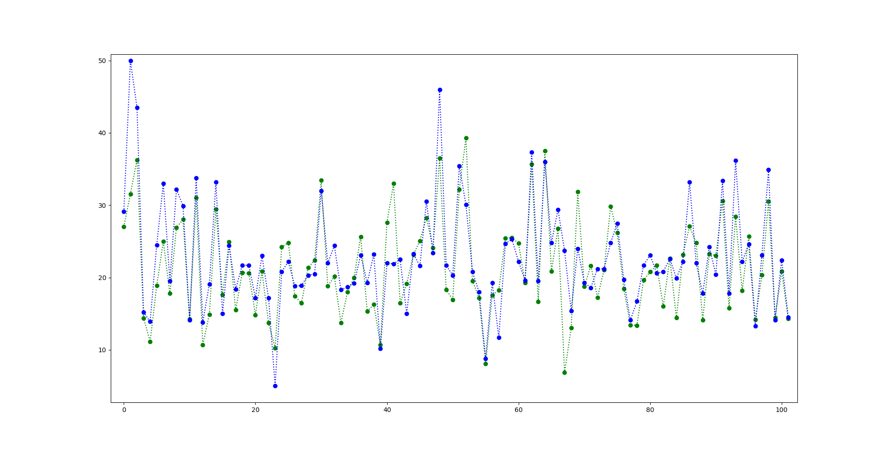

# Table of contents
1. [Introduction](#introduction)
2. [Theoretical Foundations](#paragraph1)
    1. [Gradient Descent](#subparagraph1)
3. [Visualization](#paragraph2)

## Introduction 

First we will get some data for the neural networks. For example the boston house dataset.

## Visualization 

Prediction of house prices vs. real ones

