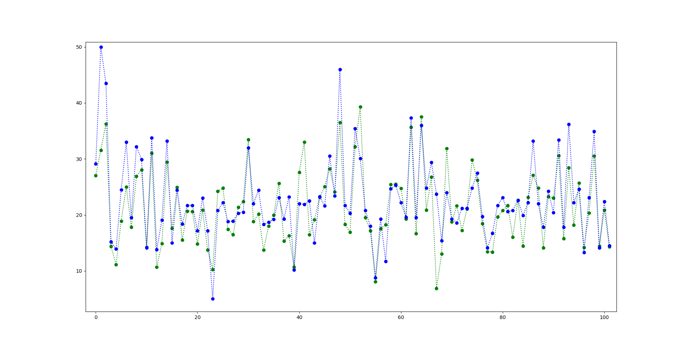

# Table of contents
1. [Abstract](#Abstract)
2. [Introduction](#Introduction)
3. [Theoretical Foundations](#TheoreticalFoundations)
    1. [Neural Networks](#NeuralNetworks)
    2. [Optimization techniques](#OT)
        1. [Gradient Descent](#GradientDescent)
        2. [Stochastic Gradient Descent](#SGD)
        3. [Adagrad](#Adagrad)
        4. [ADAM](#ADAM)
4. [Evaluation](#Evaluation)
5. [Conclusion](#Conclusion)

## Abstract 

This work will focus on explaning the different optimization methods of neural networks and evaluating them
on example datasets like the boston house price data.
Furthermore this work will give a detailed explanation of the learning process of Neural Networks
especially focusing on the Gradient Descent. 
We will assume some properties about those optimization methods and test those assumptions
by evaluating the metrics of these neural networks.

An optimization method is a way to improve the performance of the error 
function $E(X)$ of the neural network. 

## Visualization 

Prediction of house prices vs. real ones with ADAM optimizer
